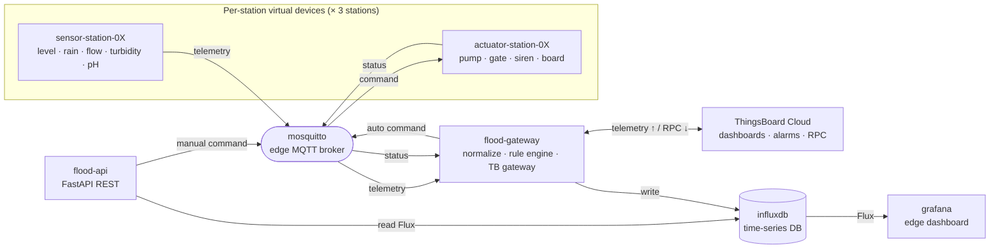
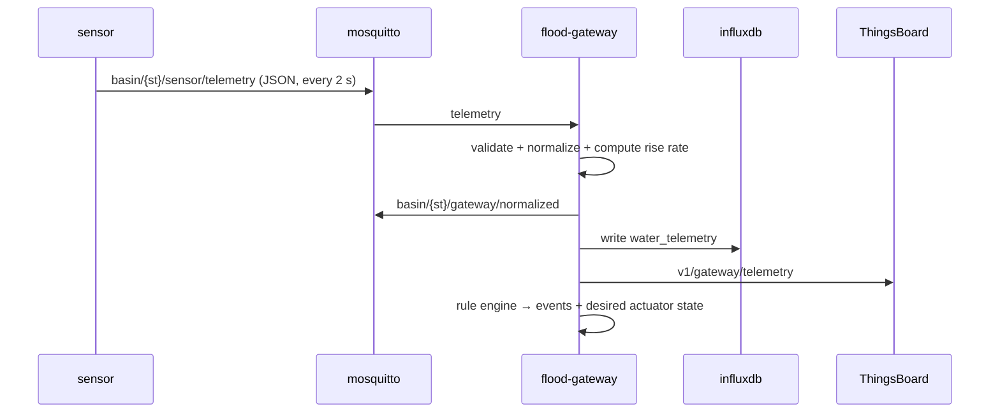
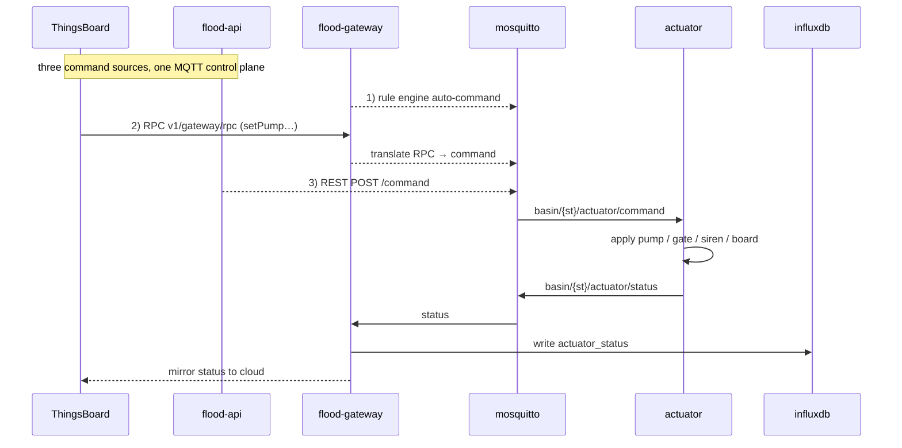
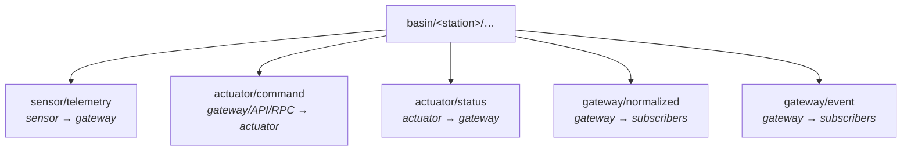

# Virtual Smart Water & Flood Early-Warning Gateway

A fully **virtualized IoT system** that monitors a river basin across several
stations, detects flood risk **at the edge**, automatically drives flood-control
actuators (pump / gate / siren / alert board), stores everything in a time-series
database, visualizes it in Grafana, and syncs **both ways** with **ThingsBoard**
(telemetry up, remote control down).

# Architecture



Everything inside the box is one **Docker Compose** project on a single private
network (`flood-net`). ThingsBoard is external (you self-host it or point at a
cloud instance — it is **optional**; the edge runs fine without it).

---

# How data flows

## Uplink — telemetry (sensor → cloud)



## Downlink — control (3 sources, one control plane)

A command can come from the **rule engine** (automatic), a **ThingsBoard RPC**, or
a **REST call** — all three end up as the _same_ MQTT command on the _same_ topic.



---

## MQTT topic design

All edge traffic uses a hierarchical scheme: `basin/<station>/<role>/<leaf>`.
It scales per station and makes wildcard subscriptions easy (the gateway
subscribes to `basin/+/sensor/telemetry`).



Exact JSON payloads for each topic are documented in the relevant service README
(see the [service map](#5-service-map)).

---

## Service map

| Service                     | Folder                                  | Build/Image              | Role                                                                  | Detailed docs                                                    |
| --------------------------- | --------------------------------------- | ------------------------ | --------------------------------------------------------------------- | ---------------------------------------------------------------- |
| `sensor-station-01/02/03`   | [`sensor/`](sensor/README.md)           | `./sensor`               | Virtual water-monitoring sensors                                      | [sensor/README.md](sensor/README.md)                             |
| `actuator-station-01/02/03` | [`actuator/`](actuator/README.md)       | `./actuator`             | Virtual pump / gate / siren / board                                   | [actuator/README.md](actuator/README.md)                         |
| `flood-gateway`             | [`gateway/`](gateway/README.md)         | `./gateway`              | **Edge brain**: normalize, rule engine, InfluxDB, ThingsBoard gateway | [gateway/README.md](gateway/README.md)                           |
| `flood-api`                 | [`flood-api/`](flood-api/README.md)     | `./flood-api`            | REST API (query state, send manual commands)                          | [flood-api/README.md](flood-api/README.md)                       |
| `mosquitto`                 | [`mosquitto/`](mosquitto/README.md)     | `eclipse-mosquitto:2`    | Edge MQTT broker (internal bus)                                       | [mosquitto/README.md](mosquitto/README.md)                       |
| `influxdb`                  | —                                       | `influxdb:2.7`           | Time-series database (edge)                                           | schema in [gateway/README.md](gateway/README.md#influxdb-schema) |
| `grafana`                   | [`grafana/`](grafana/README.md)         | `grafana/grafana:10.4.3` | Edge dashboard (auto-provisioned)                                     | [grafana/README.md](grafana/README.md)                           |
| ThingsBoard                 | [`thingsboard/`](thingsboard/README.md) | external                 | Cloud dashboard, map, alarms, RPC                                     | [thingsboard/README.md](thingsboard/README.md)                   |

Sensors and actuators are **one image each**, run three times and parameterized
purely through environment variables (`STATION_ID`, `DEVICE_ID`) — see
[`docker-compose.yml`](docker-compose.yml).

---

## Repository layout

```
flood-early-warning-system/
├── docker-compose.yml        # one-command orchestration of all services
├── .env.example              # config template — copy to .env
├── README.md                 # ← you are here (overview)
├── sensor/      { sensor.py, Dockerfile, requirements.txt, README.md }
├── actuator/    { actuator.py, Dockerfile, requirements.txt, README.md }
├── gateway/     { gateway.py, rules.py, tb_gateway.py, Dockerfile, …, README.md }
├── flood-api/   { main.py, Dockerfile, requirements.txt, README.md }
├── mosquitto/   { config/mosquitto.conf, README.md }
├── grafana/     { provisioning/{datasources,dashboards}, README.md }
├── thingsboard/ { flood-dashboard.json, …rulechain.json, README.md }
└── docs/        { scenario.md — flood-wave simulation design notes }
```

---

## Quick start

```bash
# 1. Create your local config from the template
cp .env.example .env
#    (edit .env — only needed if you want ThingsBoard cloud sync; see §9)

# 2. Build & run the ENTIRE stack with ONE command
docker compose up -d --build

# 3. Check everything is running
docker compose ps

# 4. Watch the gateway do its work (telemetry, events, commands)
docker compose logs -f flood-gateway

# 5. Stop everything (add -v to also wipe the InfluxDB / Grafana volumes)
docker compose down
```

Within one storm cycle (`LOOP_PERIOD`, default 300 s) **all three stations** cross
the warning then emergency water-level thresholds — upstream `station-01` rises
first, then `station-02`, then downstream `station-03` peaks last and highest — and
you will see the gateway emit events and drive the actuators. (The simulation is
explained in [sensor/README.md](sensor/README.md).)

## Accessing the services

| What                        | URL / command              | Credentials (from `.env`) |
| --------------------------- | -------------------------- | ------------------------- |
| **Grafana** dashboard       | http://localhost:3000      | `admin` / `admin`         |
| **InfluxDB** UI             | http://localhost:8086      | `admin` / `admin123456`   |
| **REST API** docs (Swagger) | http://localhost:8000/docs | —                         |
| **MQTT** broker             | `localhost:1883`           | anonymous                 |

Grafana opens straight onto the **Flood Early-Warning Gateway** dashboard —
datasource and panels are auto-provisioned, no clicking required
([grafana/README.md](grafana/README.md)).

## Enabling ThingsBoard (optional)

1. In ThingsBoard: **Devices → Add device**, tick _Is gateway_. Open it →
   **Manage credentials → Access token**, copy it.
2. In `.env` set `TB_HOST`, `TB_PORT`, and `TB_GATEWAY_TOKEN`.
3. `docker compose up -d flood-gateway` then watch the log for `[TB] connected.`

## Contributing

- **Pick a service**, read its README, and keep changes inside that folder where
  possible — the services are decoupled by MQTT topics and the InfluxDB schema.
- **Respect the two contracts** everything depends on: the **MQTT topic +
  payload** shapes (§4) and the **InfluxDB schema**
  ([gateway/README.md](gateway/README.md#influxdb-schema)). Change either, and you
  must update every producer/consumer of it.
- **Configuration goes through `.env`** — never hard-code hosts, ports, or
  tokens. Reach other services by **name**, never `localhost`.
- **Test a service in isolation** with `docker compose up <service>` and the
  `mosquitto_pub` / `mosquitto_sub` snippets in each README.
