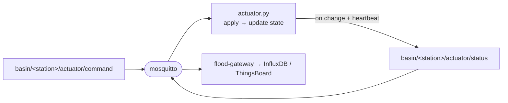

# `actuator/` — Virtual flood-control actuator

One container instance = **one station's actuator hardware**: four devices behind a
single node — a drainage **pump**, a discharge **gate/valve**, a warning **siren**,
and an alert **board** (which shows a severity word). It subscribes to its
station's command topic, applies each command, and republishes its full status.
Three instances run in the stack (`actuator-station-01/02/03`), built from **this
single image** and told apart only by `STATION_ID`.

> Part of the [Flood Early-Warning Gateway](../README.md). It is the **downlink
> endpoint**: every command — automatic ([gateway](../gateway/README.md) rule
> engine), remote (ThingsBoard RPC), or manual ([REST API](../flood-api/README.md))
> — arrives here as the same MQTT message.



---

## Files

| File | Purpose |
|---|---|
| `actuator.py` | The whole actuator (no other modules). |
| `requirements.txt` | `paho-mqtt==1.6.1`. |
| `Dockerfile` | `python:3.11-slim`, installs deps, runs `actuator.py`. |

---

## Configuration (environment variables)

| Variable | Default | Meaning |
|---|---|---|
| `STATION_ID` | `station-01` | **Selects which station this actuator serves**; builds the command/status topics. |
| `DEVICE_ID` | `actuator-<STATION_ID>` | MQTT client id + `device_id` field in the status payload. |
| `MQTT_BROKER` / `MQTT_PORT` | `mosquitto` / `1883` | Edge broker (a service name — never `localhost`). |
| `STATUS_INTERVAL` | `10` | Seconds between status **heartbeats** (optional; not in `.env.example`). |

---

## Behaviour

The PRD requires the actuator to *subscribe to the station command topic, parse
JSON, update the pump/gate/siren/board state, republish the status, and log*
(*"Subscribe topic lệnh… Cập nhật trạng thái… Publish lại trạng thái… ghi log"*).

1. **Subscribe** to `basin/<station>/actuator/command` on connect, and immediately
   publish the initial state so the gateway/cloud know the starting point.
2. **On each command** (`on_message`): parse the JSON, call `apply_command()` for
   the named `target`, record the `reason`, and **echo the full status
   immediately** so the change is visible without waiting for the heartbeat.
3. **Heartbeat:** every `STATUS_INTERVAL` seconds it republishes the status even if
   nothing changed — so the gateway can persist `actuator_status` to InfluxDB
   **continuously** (Grafana's actuator timeline never goes stale).

State is held in a single dict guarded by a lock (the heartbeat thread and the MQTT
callback both touch it).

### Command → state mapping (`apply_command`)

The command's `action` is interpreted **per target**, accepting a few synonyms so
that an RPC boolean, a REST string, or a gateway word all work:

| `target` | Accepted `action` values | Resulting state |
|---|---|---|
| `pump` | `on` / `true` / `open` → on, else off | `pump`: `on` \| `off` |
| `gate` | `open` / `on` / `true` → open, else closed | `gate`: `open` \| `closed` |
| `siren` | `on` / `true` → on, else off | `siren`: `on` \| `off` |
| `board` | any severity word, stored verbatim | `board`: `normal` \| `advisory` \| `warning` \| `emergency` |

An unknown `target` is logged and ignored.

---

## Messages

### Input — command (subscribed)

Topic **`basin/<station>/actuator/command`** (`target ∈ {pump, gate, siren, board}`):

```json
{
  "station_id": "station-01",
  "target": "pump",
  "action": "on",
  "reason": "water_level_high",
  "timestamp": "2026-06-10T10:00:05Z"
}
```

### Output — status (published)

Topic **`basin/<station>/actuator/status`** — the **full** state every time
(echoed on change, and on the heartbeat):

```json
{
  "device_id": "actuator-station-01",
  "station_id": "station-01",
  "pump": "on",
  "gate": "open",
  "siren": "off",
  "board": "warning",
  "last_command_reason": "water_level_high",
  "timestamp": "2026-06-10T10:00:06Z"
}
```

The gateway writes this to InfluxDB (`actuator_status`) and mirrors it to
ThingsBoard.

---

## Run / test in isolation

```bash
# Run one actuator + the broker
docker compose up --build mosquitto actuator-station-03

# Watch it react
docker compose logs -f actuator-station-03

# Drive it by hand (same control plane the gateway/RPC/REST use):
docker compose exec mosquitto mosquitto_pub \
  -t basin/station-03/actuator/command \
  -m '{"station_id":"station-03","target":"siren","action":"on","reason":"manual"}'

# Observe the status it publishes back
docker compose exec mosquitto mosquitto_sub -t 'basin/+/actuator/status' -v
```

> **Heads-up:** automatic control is **declarative** — if you manually toggle a
> device whose station later changes rule state, the gateway re-asserts the safe
> state on the next telemetry tick. This is intentional (the automatic flood logic
> wins). See [gateway/README.md](../gateway/README.md#rule-engine).

---

## Reconnect behaviour

The connect loop retries the broker every 5 s, and `paho`'s `loop_start()` auto-
reconnects after a drop; `on_connect` re-subscribes and re-announces state — so an
actuator survives a broker restart (PRD advanced item: *reconnect on MQTT loss*).

---

## Extending

- **Add a device** (e.g. a flood barrier): add a branch in `apply_command()`, a key
  in the `state` dict and `build_status()`, then persist it in
  [`gateway/gateway.py`](../gateway/gateway.py) `write_status()` and have the
  [rule engine](../gateway/rules.py) target it.
- **Model actuation delay / failure:** add a sleep or a random failure in
  `apply_command()` before updating state to simulate real hardware.
