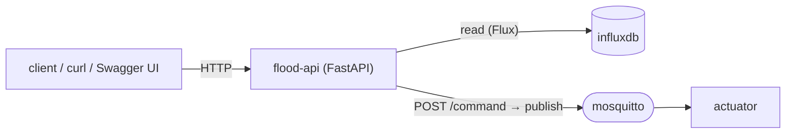

# `flood-api/` — REST API (FastAPI)

A small HTTP API to **query station state** and **send manual commands**. It is the
human-/script-friendly front door to the same data and control plane the gateway
uses.

- **Reads** come straight from **InfluxDB** (the edge source of truth the gateway
  writes) — the API holds no state of its own.
- The **one write**, `POST /command`, publishes to the actuator command topic over
  **MQTT** — so a manual command behaves **exactly** like a gateway or ThingsBoard
  command (same topic, same actuator code path).

> Part of the [Flood Early-Warning Gateway](../README.md). It reads the
> [gateway's InfluxDB schema](../gateway/README.md#influxdb-schema) and publishes to
> the [actuator's](../actuator/README.md) command topic.



---

## Files

| File | Purpose |
|---|---|
| `main.py` | The whole API (routes + InfluxDB query helpers + MQTT publisher). |
| `requirements.txt` | `fastapi`, `uvicorn[standard]`, `paho-mqtt`, `influxdb-client`. |
| `Dockerfile` | `python:3.11-slim`, runs `uvicorn main:app` on port 8000. |

---

## Configuration (environment variables)

| Variable | Default | Meaning |
|---|---|---|
| `MQTT_BROKER` / `MQTT_PORT` | `mosquitto` / `1883` | Broker to publish commands to. |
| `INFLUXDB_URL/TOKEN/ORG/BUCKET` | `…/…/navis/flood` | Time-series DB to read from. |
| `STATIONS` | `station-01,02,03` | Valid station ids (requests for others → 404). |

Published on host port **8000**. Interactive docs: **http://localhost:8000/docs**.

---

## Endpoints

The five endpoints required by the PRD:

| Method | Endpoint | Purpose | Backed by |
|---|---|---|---|
| `GET` | `/health` | API + InfluxDB health | `influx.health()` |
| `GET` | `/stations` | All stations with latest level + board | `water_telemetry`, `actuator_status` |
| `GET` | `/stations/{id}/state` | Latest telemetry + actuator status | `water_telemetry`, `actuator_status` |
| `GET` | `/stations/{id}/events?limit=50&hours=24` | Recent events | `gateway_events` |
| `POST` | `/stations/{id}/command` | Send a manual command (→ MQTT) | publishes to `basin/{id}/actuator/command` |

### Reads

Each read runs a Flux query that **pivots** fields into one row and takes the most
recent record (`_latest()`), then strips Influx bookkeeping columns (`_clean()`).
`/stations/{id}/state` returns `{station_id, telemetry, actuator}`.

### `POST /command`

Body (`CommandBody`):

```json
{ "target": "pump", "action": "on", "reason": "manual_api" }
```

- `target` must be one of `pump | gate | siren | board` (else **400**).
- Unknown `station_id` → **404**; MQTT publish failure → **503**.
- On success it returns the exact command it published (including a server
  timestamp), e.g. `{"published": true, "topic": "...", "command": {...}}`.

---

## Examples

```bash
# Health
curl http://localhost:8000/health

# All stations (latest level + board)
curl http://localhost:8000/stations

# One station's full state
curl http://localhost:8000/stations/station-01/state

# Recent events (last 5)
curl "http://localhost:8000/stations/station-01/events?limit=5"

# Manual command — same control plane as the gateway & ThingsBoard RPC
curl -X POST http://localhost:8000/stations/station-03/command \
     -H "Content-Type: application/json" \
     -d '{"target":"pump","action":"on","reason":"manual_test"}'
```

> **Note:** automatic control is declarative — if you manually override a device at
> a station whose rule state later changes, the gateway re-asserts the safe state on
> the next telemetry tick. This is intentional (the automatic flood logic wins).
> See [gateway/README.md](../gateway/README.md#rule-engine).

---

## Run / test in isolation

```bash
# Needs InfluxDB (for reads) and the broker (for commands)
docker compose up -d --build influxdb mosquitto flood-gateway flood-api
open http://localhost:8000/docs        # try every endpoint from the browser
```

If the broker is down at startup the API still serves reads; commands return 503
until the broker is reachable (the MQTT client reconnects in the background).

---

## Extending

- **New read** (e.g. basin summary): add a route that builds a Flux query like
  `_latest()` and reuse `_clean()`.
- **Validation / auth:** `CommandBody` is a Pydantic model — add fields/validators
  there; add an API-key dependency for write protection.
- **Pagination / filtering on events:** extend the `limit` / `hours` query params
  in `get_events`.
