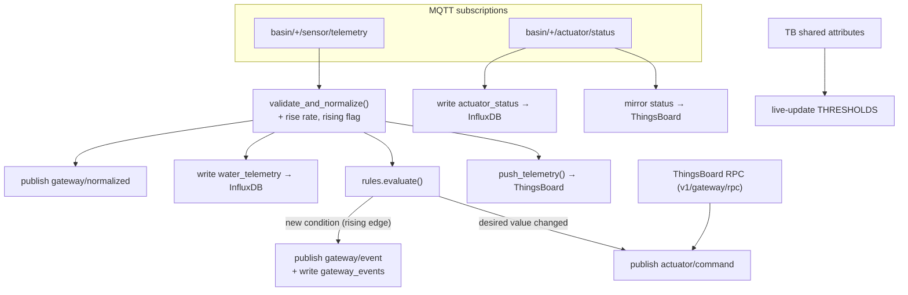
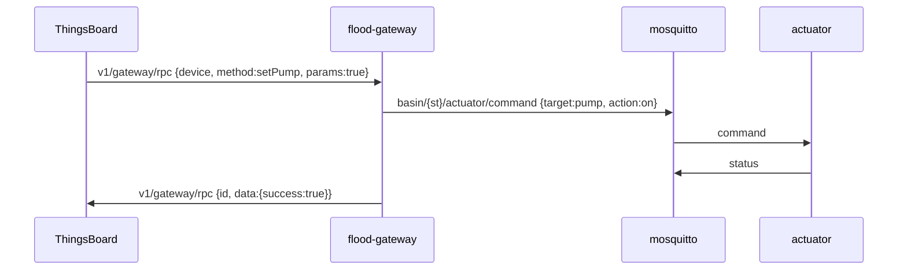
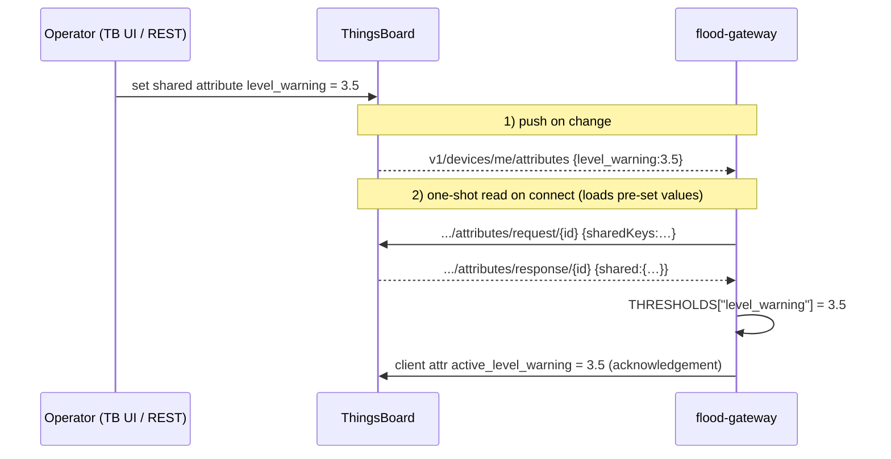

# `gateway/` — Edge IoT Gateway (the brain)

The **most important component** in the system. The single `flood-gateway`
container sits between the field devices and both the local store and the cloud,
and does five jobs for every station:

1. **Subscribe** to all sensor telemetry; **validate + normalize** it and compute
   the water-level **rise rate** vs. the previous reading.
2. **Persist** telemetry, events and actuator status to **InfluxDB**, and
   republish the normalized reading.
3. Run a **multi-level rule engine** (≥ 4 rules) → emit **events** and send
   **automatic commands** to the actuators.
4. Act as a **ThingsBoard Gateway**: push every station's telemetry to the cloud,
   and turn server-side **RPC** into local MQTT commands.
5. Accept **live threshold tuning** from the cloud via shared attributes — no
   restart.

> Part of the [Flood Early-Warning Gateway](../README.md). It consumes from
> [sensors](../sensor/README.md), commands [actuators](../actuator/README.md),
> writes the InfluxDB that [Grafana](../grafana/README.md) and the
> [REST API](../flood-api/README.md) read, and bridges to
> [ThingsBoard](../thingsboard/README.md).

---

## Processing pipeline



---

## Files

| File | Responsibility |
|---|---|
| `gateway.py` | Main process: MQTT + InfluxDB I/O, normalization, event/command dispatch, wiring. |
| `rules.py` | **Pure** rule engine — no I/O. Given a reading + thresholds, returns desired actuator state + active alarm conditions. Unit-testable in isolation. |
| `tb_gateway.py` | ThingsBoard Gateway MQTT client (connect / telemetry / attributes / RPC / shared attributes). Degrades gracefully when disabled. |
| `requirements.txt` | `paho-mqtt==1.6.1`, `influxdb-client==1.43.0`. |
| `Dockerfile` | `python:3.11-slim`, runs `gateway.py`. |

---

## Configuration (environment variables)

| Variable | Default | Meaning |
|---|---|---|
| `MQTT_BROKER` / `MQTT_PORT` | `mosquitto` / `1883` | Edge broker. |
| `STATIONS` | `station-01,02,03` | Stations to announce to ThingsBoard. |
| `BASIN_ID` | `to-lich` | Fallback basin id if a payload omits it. |
| `INFLUXDB_URL/TOKEN/ORG/BUCKET` | `…/…/navis/flood` | Time-series DB connection. |
| `TB_HOST` / `TB_PORT` / `TB_GATEWAY_TOKEN` | empty / `1883` / empty | ThingsBoard — **empty disables cloud sync** (edge-only). |
| `LEVEL_WARNING` | `3.0` | Rule R1 water-level threshold (m). |
| `LEVEL_EMERGENCY` | `4.0` | Rule R2 water-level threshold (m). |
| `RAINFALL_ADVISORY` | `40` | Rule R3 rainfall threshold (mm/h). |
| `TURBIDITY_MAX` | `100` | Rule R4 turbidity threshold (NTU). |
| `PH_MIN` / `PH_MAX` | `6` / `9` | Rule R4 pH band. |

The six threshold values are **bootstrap defaults** only — they can be retuned at
runtime from ThingsBoard ([see below](#live-threshold-tuning-shared-attributes)).

---

## Normalization

`validate_and_normalize(station_id, data)`:

- **Validates** that the five required numeric fields are present and castable
  (`water_level, flow_rate, rainfall, turbidity, ph`); a bad payload is **dropped**
  with a log line, never stored.
- **Computes the rise rate** against the previous reading per station:
  `rise_rate = Δlevel / Δt × 60` (metres **per minute**), and a boolean `rising`
  (Δlevel > `RISE_EPSILON` = 0.005 m/sample) that rule R3 needs.
- Keeps per-station state (`prev_level`, `prev_ts`, `last_desired`, `active`,
  `loc_sent`) in the in-memory `STATE` dict.

The normalized reading is republished to `basin/<station>/gateway/normalized` and
written to InfluxDB.

---

## Rule engine

Implemented in **`rules.py`** as a **pure function** — `evaluate(reading,
thresholds)` returns `(desired, active)` and does no I/O, so it is trivial to unit
test (PRD advanced item: *unit test cho rule engine*).

It is **declarative**: the desired actuator state is **recomputed from scratch
every tick**, so devices switch **off** again as the water recedes — you never have
to send an explicit "turn off" rule. The four mandatory PRD rules, tiered
**advisory / warning / emergency**:

| # | Condition | Desired actuator state | Event / severity |
|---|---|---|---|
| **R1** | `water_level > LEVEL_WARNING` (3.0) | pump **on**, gate **open**, board **warning** | `flood_warning` / warning |
| **R2** | `water_level > LEVEL_EMERGENCY` (4.0) | + siren **on**, board **emergency** | `flood_emergency` / emergency |
| **R3** | `rainfall > RAINFALL_ADVISORY` (40) **and** level rising | board **advisory** (if not already higher) | `heavy_rain` / advisory |
| **R4** | `turbidity > TURBIDITY_MAX` (100) **or** `pH < PH_MIN` **or** `pH > PH_MAX` | (alert only) | `water_quality_alert` / warning |

R2 supersedes R1 (emergency wins). R3 only raises the board if nothing more severe
is active.

### Events fire on a rising edge

`evaluate()` returns the **set of currently-active conditions**. `gateway.py`
diffs that against the previously-active set and emits an event **only for a
newly-active condition** — so events are **not** repeated every 2 seconds while a
flood persists. Each event is published to `basin/<station>/gateway/event` and
written to `gateway_events`.

### Commands are sent only on change

For each of `pump / gate / siren / board`, the gateway compares the new desired
value with `last_desired` and publishes a command **only for the targets that
changed** — minimizing MQTT chatter while still guaranteeing the actuator converges
to the rule-engine's intent. The command `reason` is derived from the board level
(`water_level_emergency` / `water_level_high` / `heavy_rain_rising` / `normal`).

---

## InfluxDB schema

The gateway is the **sole writer**. The [REST API](../flood-api/README.md) and
[Grafana](../grafana/README.md) only read these three measurements — **this schema
is a contract; changing it means updating both readers.**

| Measurement | Tags | Fields |
|---|---|---|
| `water_telemetry` | `basin_id`, `station_id` | `water_level`, `flow_rate`, `rainfall`, `turbidity`, `ph`, `rise_rate` |
| `gateway_events` | `station_id`, `event_type`, `severity` | `value`, `threshold`, `action_taken` |
| `actuator_status` | `station_id` | `pump`, `gate`, `siren`, `board`, `last_command_reason` (string fields) |

`connect_influxdb()` **blocks until InfluxDB health is `pass`** before writing, so
the first telemetry points are never lost to the database's one-time setup.

Query example (use your own `.env` values):

```bash
docker compose exec influxdb influx query \
  'from(bucket:"flood") |> range(start:-10m) |> filter(fn:(r)=> r._measurement=="water_telemetry")' \
  --org navis --token flood-edge-token-please-change
```

---

## ThingsBoard integration

`tb_gateway.py` connects to a (self-hosted) ThingsBoard over MQTT using the
**Gateway device's access token as the MQTT username**, and speaks the standard
[Gateway API](https://thingsboard.io/docs/reference/gateway-mqtt-api/). It runs on
a **background thread** and **degrades gracefully**: if `TB_HOST` or
`TB_GATEWAY_TOKEN` is empty (or the server is unreachable), all calls are no-ops
and the edge keeps doing everything else.

| Direction | Topic | Purpose |
|---|---|---|
| ↑ connect | `v1/gateway/connect` | Announce each station as a sub-device (it then appears in TB). |
| ↑ telemetry | `v1/gateway/telemetry` | Push per-station telemetry **and** mirrored actuator status. |
| ↑ attributes | `v1/gateway/attributes` | Send each station's static `latitude`/`longitude` once → map widget. |
| ↓ RPC | `v1/gateway/rpc` | Receive a server command for a sub-device; reply with the result. |
| ↕ device attrs | `v1/devices/me/attributes` (+ `.../request|response`) | Gateway's own client attrs up; shared-attribute updates down. |

### Remote control (RPC → local command)

A ThingsBoard RPC button sends to a station device → TB routes it to the gateway →
`rpc_handler` translates it into a local MQTT command (the **same** topic the rule
engine uses) and replies `{"success": true}`:

| RPC method | Param | Local command |
|---|---|---|
| `setPump` | bool | `pump` = `on`/`off` |
| `setGate` | bool | `gate` = `open`/`close` |
| `setSiren` | bool | `siren` = `on`/`off` |
| `setBoard` | string | `board` = the string |



> Because control is declarative, a manual RPC toggle can be **overridden** on the
> next telemetry tick if the water level dictates — the automatic flood logic wins.

### Live threshold tuning (shared attributes)

The six thresholds can be retuned from the cloud **without a restart**, by setting
matching **shared attributes** on the *gateway* device:
`level_warning`, `level_emergency`, `rainfall_advisory`, `turbidity_max`,
`ph_min`, `ph_max`.

This works because thresholds are used **only** by the rule engine — sensors and
actuators never see them, so a remote change only has to reach the gateway, and the
next telemetry tick applies it to **all** stations (thresholds are basin-wide).

Two mechanisms cooperate (both in `tb_gateway.py`):



The gateway echoes the values in force back as **client** attributes named
`active_<key>` so you can confirm the change landed. Non-numeric values and unknown
keys are ignored. Set them in the TB UI (device → Attributes → Shared) or via REST:

```bash
curl -X POST "http://<TB_HOST>:8080/api/plugins/telemetry/DEVICE/<gatewayDeviceId>/attributes/SHARED_SCOPE" \
     -H "X-Authorization: Bearer <JWT>" -H "Content-Type: application/json" \
     -d '{"level_warning": 3.5, "level_emergency": 4.5}'
```

---

## Run / test

```bash
# Full stack (gateway needs the broker + InfluxDB)
docker compose up -d --build
docker compose logs -f flood-gateway      # EVENT / CMD / [TB] lines

# Unit-test the pure rule engine (no containers, no I/O)
python -c "import rules; print(rules.evaluate(
  {'water_level':4.2,'rainfall':60,'turbidity':30,'ph':7.0,'rising':True},
  {'level_warning':3.0,'level_emergency':4.0,'rainfall_advisory':40,
   'turbidity_max':100,'ph_min':6,'ph_max':9}))"
```

Expected: `desired` has `siren:'on'`, `board:'emergency'`; `active` contains
`flood_emergency` and `heavy_rain`.

---

## Reconnect & resilience

- **InfluxDB:** blocks until healthy, retries every 5 s; per-write failures are
  caught and logged without crashing the loop.
- **MQTT:** `loop_forever()` wrapped in a retry loop (5 s) — survives broker
  restarts.
- **ThingsBoard:** background reconnect loop (10 s); never blocks edge work.

(PRD advanced item: *cơ chế reconnect khi mất kết nối MQTT/ThingsBoard*.)

---

## Extending

- **Add a rule:** extend `rules.evaluate()` (keep it pure). If it drives a new
  actuator target, also handle it in `apply_command()`
  ([actuator](../actuator/README.md)) and `write_status()`.
- **New RPC method:** add it to the `mapping` in `rpc_handler` (`gateway.py`).
- **Per-station thresholds:** keep a `THRESHOLDS` map keyed by station and use the
  `v1/gateway/attributes` request/subscribe topics instead of the device-scope
  ones. Off by default because the scenario treats thresholds as basin-wide.
- **Sensor-offline / pump-maintenance rules** (PRD rule #5, optional): track
  `prev_ts` age and pump-on duration in `STATE` and emit events from `handle_*`.
