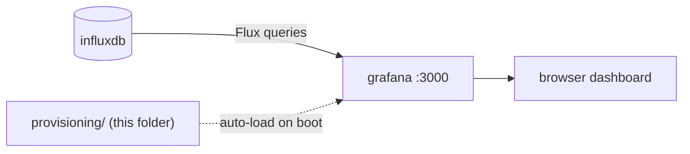

# `grafana/` — Edge dashboard (auto-provisioned)

The **edge monitoring dashboard**. It reads the [gateway's InfluxDB
data](../gateway/README.md#influxdb-schema) and visualizes water levels, rainfall,
flow/quality, actuator states and events. Runs from the stock
`grafana/grafana:10.4.3` image — **no custom code**; this folder is pure
**provisioning** so the datasource and dashboard exist the moment Grafana starts.

> Part of the [Flood Early-Warning Gateway](../README.md). Open it at
> **http://localhost:3000** (login `admin` / `admin` from `.env`). It lands
> straight on the **Flood Early-Warning Gateway** dashboard — nothing to click.



---

## Files

| File | Purpose |
|---|---|
| `provisioning/datasources/influxdb.yml` | Defines the **InfluxDB** datasource (Flux), interpolated from env. |
| `provisioning/dashboards/dashboards.yml` | Provider that loads every dashboard JSON in the folder. |
| `provisioning/dashboards/flood-dashboard.json` | The dashboard itself (panels + variables). |

The folder is mounted read-only into the container
(`./grafana/provisioning:/etc/grafana/provisioning:ro`), and the datasource secrets
come from the **grafana container's environment**, which
[`docker-compose.yml`](../docker-compose.yml) fills from your `.env`
(`INFLUXDB_URL/ORG/BUCKET/TOKEN`). No tokens live in the JSON/YAML.

---

## Panels

The six panels required by the PRD (Yêu cầu Grafana Dashboard):

| # | Panel | Shows |
|---|---|---|
| 1 | **Water level per station** | Level over time for all 3 stations, with **warning (3.0)** and **emergency (4.0)** threshold lines. Default range `now-10m` so the downstream lag is visible. |
| 2 | **Rainfall per station (mm/h)** | Rainfall over time, drawn as **lines** (not filled) so every station stays readable. |
| 3 | **Flow & quality — `$station`** | `flow_rate` + `turbidity` (left axis) and `pH` (right axis). **Repeats** into one panel per station. |
| 4 | **Actuators — `$station`** | State timeline of pump / gate / siren / board. **Repeats** per station. |
| 5 | **Event count by severity** | advisory / warning / emergency counts over time. |
| 6 | **Most recent events** | Table: `station_id`, `event_type`, `severity`, `action_taken`. |

This covers every required visualization: per-station level (with thresholds),
rainfall, flow + quality, actuator status, event counts by level, and a recent-event
table.

---

## Dashboard variables

| Variable | Default | Purpose |
|---|---|---|
| `station` | `All` (top-left) | Drives the **repeat** on panels 3 & 4 — pick one station to focus, or *All* for a tidy grid (instead of 9 lines / 12 rows crammed together). |
| `bucket` | `flood` (hidden) | The InfluxDB bucket the queries read. Grafana can't interpolate `.env` into dashboard JSON, so **if you change `INFLUXDB_BUCKET`, update this** (Dashboard settings → Variables) or its default in `flood-dashboard.json`. The **org** is handled automatically (the datasource uses `${INFLUXDB_ORG}`). |

---

## Verify / test

```bash
docker compose up -d --build          # whole stack
open http://localhost:3000            # admin / admin
# Datasource health: Grafana → Connections → Data sources → InfluxDB → Test
```

Give it ~30 s after first boot for data to accumulate. If panels are empty, see
[Troubleshooting](#troubleshooting).

---

## Editing the dashboard

The provider sets `allowUiUpdates: true` and `editable: true`, so you can tweak
panels in the browser. **To persist changes back into the repo:** Dashboard
settings → **JSON Model** → copy it into `flood-dashboard.json` (or export and
replace the file). On the next `docker compose up` the provisioned JSON wins again.

When adding a panel that uses a **new field**, make sure the gateway actually writes
it ([InfluxDB schema](../gateway/README.md#influxdb-schema)).

---

## Troubleshooting

| Symptom | Cause / fix |
|---|---|
| All panels empty | Data not flowing yet (~30 s), or bucket mismatch — check the `bucket` variable matches `INFLUXDB_BUCKET`, and *Test* the datasource. |
| Datasource error / 404 org | `INFLUXDB_ORG/BUCKET/TOKEN` changed after first run; InfluxDB only self-initializes on an empty volume — `docker compose down -v && docker compose up -d`. |
| Only one station in repeated panels | The `station` variable is set to a single station — switch it back to *All*. |
| Threshold lines missing on panel 1 | They are panel **thresholds** (3.0 / 4.0) — preserved in the JSON; if you rebuilt the panel, re-add them under Field → Thresholds (show as lines). |

> For the **cloud** dashboard, map and multi-level alarms on ThingsBoard, see
> [thingsboard/README.md](../thingsboard/README.md).
