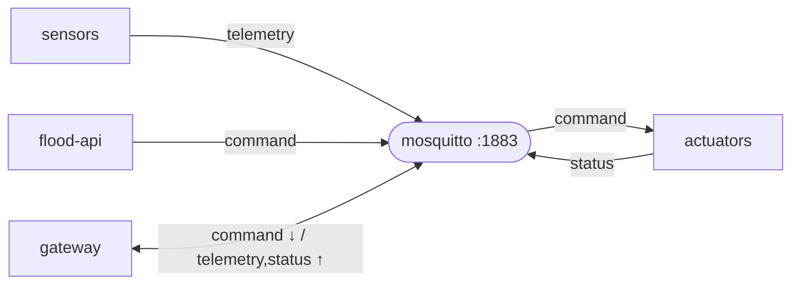

# `mosquitto/` — Edge MQTT broker

The **internal communication bus** at the edge. Every device on a station talks
through this broker — sensors publish telemetry, the gateway and the REST API
publish commands, actuators publish status. It is the **one place** all MQTT
traffic flows through (see the topic design in the [main README](../README.md#4-mqtt-topic-design)).

Runs from the stock `eclipse-mosquitto:2` image — **no custom code**, just a config
file. This folder holds that config.

> Part of the [Flood Early-Warning Gateway](../README.md). Producers:
> [sensors](../sensor/README.md), [gateway](../gateway/README.md),
> [flood-api](../flood-api/README.md). Consumers:
> [gateway](../gateway/README.md), [actuators](../actuator/README.md).



---

## Files

| File | Purpose |
|---|---|
| `config/mosquitto.conf` | Broker configuration (mounted read-only into the container). |

```conf
listener 1883
allow_anonymous true
```

- **`listener 1883`** — listen on the standard MQTT port.
- **`allow_anonymous true`** — no auth, fine for this **local, virtualized lab**.
  For anything exposed, see [Hardening](#hardening).

In [`docker-compose.yml`](../docker-compose.yml) the folder is bind-mounted
read-only (`./mosquitto/config:/mosquitto/config:ro`) and port `1883` is published
to the host so you can use `mosquitto_pub` / `mosquitto_sub` from your machine.

---

## Inspecting the bus

The broker image ships the CLI clients, so the easiest way to watch traffic is from
inside the container:

```bash
# Watch EVERYTHING on the basin (telemetry, commands, status, events)
docker compose exec mosquitto mosquitto_sub -t 'basin/#' -v

# Just telemetry, or just one station
docker compose exec mosquitto mosquitto_sub -t 'basin/+/sensor/telemetry' -v
docker compose exec mosquitto mosquitto_sub -t 'basin/station-03/#' -v

# Inject a command by hand (same plane the gateway/RPC/REST use)
docker compose exec mosquitto mosquitto_pub -t basin/station-03/actuator/command \
  -m '{"station_id":"station-03","target":"siren","action":"on","reason":"manual"}'
```

From the host (port 1883 is published) you can use a local `mosquitto_sub`/MQTT
Explorer against `localhost:1883`.

---

## Topics on this broker

| Topic | Producer → Consumer |
|---|---|
| `basin/<station>/sensor/telemetry` | sensor → gateway |
| `basin/<station>/actuator/command` | gateway / API / RPC → actuator |
| `basin/<station>/actuator/status` | actuator → gateway |
| `basin/<station>/gateway/normalized` | gateway → subscribers |
| `basin/<station>/gateway/event` | gateway → subscribers |

> The `v1/gateway/*` topics are a **separate** connection — the gateway speaks those
> to **ThingsBoard's** broker, not to this one. See
> [gateway/README.md](../gateway/README.md#thingsboard-integration).

---

## Hardening

`allow_anonymous true` is deliberately open for a self-contained demo. To lock it
down:

1. Add a password file and set `allow_anonymous false` + `password_file …` in
   `mosquitto.conf`.
2. Give each service `MQTT_USERNAME` / `MQTT_PASSWORD` env vars and set them on the
   `paho` clients.
3. For TLS, add a `listener 8883` with `cafile`/`certfile`/`keyfile`.

---

## Troubleshooting

| Symptom | Fix |
|---|---|
| Producers log `Connection refused` | Broker not up yet — services retry every 5 s; check `docker compose logs mosquitto`. |
| Nothing on `mosquitto_sub` | Confirm sensors are running and the topic filter matches (`basin/#` catches all). |
| Port 1883 already in use | Another broker on the host — stop it or change the published port in `docker-compose.yml`. |
