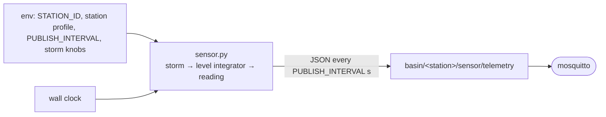
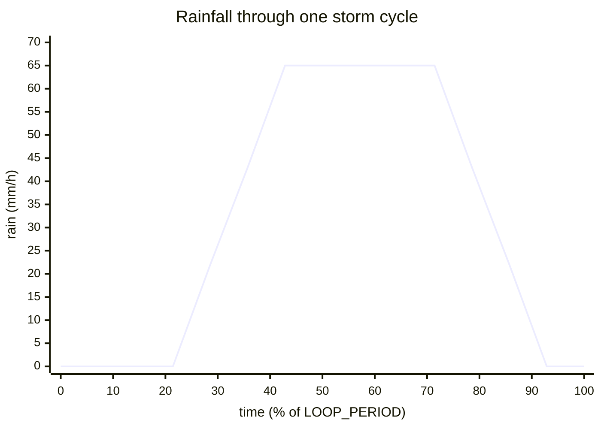

# `sensor/` — Virtual water-monitoring station

One container instance = **one observation station** on the river basin. It
periodically simulates the station's water readings and publishes them as JSON to
MQTT. Three instances run in the stack (`sensor-station-01/02/03`), built from
**this single image** and told apart only by `STATION_ID`.

> Part of the [Flood Early-Warning Gateway](../README.md). Upstream of the
> [gateway](../gateway/README.md), which consumes what this publishes.



---

## Files

| File | Purpose |
|---|---|
| `sensor.py` | The whole simulator (no other modules). |
| `requirements.txt` | `paho-mqtt==1.6.1`. |
| `Dockerfile` | `python:3.11-slim`, installs deps, runs `sensor.py`. |

---

## Configuration (environment variables)

Read at startup (PRD requirement: *"Đọc env: BASIN_ID, STATION_ID, DEVICE_ID,
MQTT_BROKER, PUBLISH_INTERVAL"*). Set in [`.env`](../.env.example) and
[`docker-compose.yml`](../docker-compose.yml).

### Per-station identity

| Variable | Default | Meaning |
|---|---|---|
| `STATION_ID` | `station-01` | **Names which station this container is** (used in the MQTT topic, payload, and default `DEVICE_ID`). |
| `DEVICE_ID` | `sensor-<STATION_ID>` | MQTT client id + `device_id` field in the payload. |
| `BASIN_ID` | `red-river` | Basin name, echoed in every payload. |
| `MQTT_BROKER` / `MQTT_PORT` | `mosquitto` / `1883` | Edge broker (a service name — never `localhost`). |
| `PUBLISH_INTERVAL` | `2` | Seconds between publishes. |

### Per-station basin profile (set per container in [`docker-compose.yml`](../docker-compose.yml))

These used to be a hardcoded `BASIN` table in `sensor.py`; they are now env, so the
basin topology can be retuned — or stations added — without touching code. `.env`
can't hold them (it is shared by every service), so each `sensor-station-*` service
defines its own block. Defaults below are station-01.

| Variable | Default | Meaning |
|---|---|---|
| `STATION_NAME` | `Yên Bái` | Gauge label, echoed in every payload (drives the ThingsBoard map). |
| `STATION_ROLE` | `upstream` | `upstream` / `midstream` / `downstream` — purely descriptive. |
| `STATION_LAT` / `STATION_LON` | `21.7050` / `104.8690` | Real Red River gauge position (for the map). |
| `STATION_LAG` | `0.0` | Travel-time delay as a **fraction of `LOOP_PERIOD`** (not seconds) — spreads the wave downstream. Keep well under the calm fraction. |
| `STATION_BASE` | `1.0` | Resting water level (m) — higher downstream. |
| `STATION_PEAK` | `4.8` | Crest level (m) at sustained peak rain — sets the severity band; `gain` is derived from it. |
| `STATION_CAP` | `6.5` | Hard safety clamp (m), far above `peak`. |

### Shared storm knobs (same for all stations → keeps them correlated)

| Variable | Default | Meaning |
|---|---|---|
| `LOOP_PERIOD` | `300` | Seconds per storm cycle. |
| `PEAK_RAIN` | `65` | mm/h at the storm plateau (must exceed `RAINFALL_ADVISORY`). |
| `DRAINAGE_K` | `0.25` | Response rate — how fast the level tracks rain up, and recedes back down. |
| `GUST_MM` / `GUST_VOL` / `GUST_REVERT` | `10` / `2.2` / `0.10` | Rainfall **gust** random walk (amplitude / volatility / mean-reversion) so the heavy-rain plateau surges & lulls instead of sitting flat. |
| `SCENARIO_EPOCH` | `0` | Shared `t0`; set near launch time for a clean cold start in the calm phase. |

---

## What it simulates, and why

The PRD requires the level to **vary with rainfall, keep its previous value, and
trend** — *not* independent random noise (*"mô phỏng mực nước biến đổi theo lượng
mưa … lưu giá trị trước và thay đổi có xu hướng, không random độc lập"*). It also
requires the level to **exceed thresholds** and produce **abnormal turbidity/pH**.

This sim goes one step further into a **correlated basin scenario**: a *single*
storm drives the whole basin, and the flood wave **marches downstream** while
growing — the textbook early-warning story (the upstream gauge rises before the
city floods).

### 1. One shared storm (a trapezoid on the wall clock)

Every container evaluates the **same** storm from the **same** wall clock, so they
stay in lockstep with **no messaging between them and no coordinator**. The storm
intensity over one `LOOP_PERIOD` cycle is a trapezoid:



| Phase | Fraction of cycle | Rain |
|---|---|---|
| **Calm** | `0.30` | 0 — the quiet baseline that makes each storm read as a discrete event |
| **Rising** | `0.15` | ramps `0 → PEAK_RAIN` |
| **Plateau** | `0.30` | sustained `PEAK_RAIN` (with gusts) |
| **Receding** | remainder (`0.25`) | ramps back to 0 |

`storm_intensity(phase)` returns this 0..1 shape; the caller turns it into mm of
rain and adds the gust.

### 2. Each station reads the storm offset by a travel-time `lag`

The downstream stations see the **same** storm but **later** — `lag` is a
*fraction* of `LOOP_PERIOD`, so the wave marches at the same visible pace whatever
the cycle length:

```python
phase    = (now − SCENARIO_EPOCH − lag) % LOOP_PERIOD
rainfall = PEAK_RAIN · storm_intensity(phase) + gust + small noise
```

### 3. Water level **integrates** rain minus drainage (this is the trend)

The level is **not** drawn at random each tick — it carries its previous value and
moves with a tendency:

```python
level += gain · rainfall − DRAINAGE_K · (level − base)
```

Rain pushes the level up; drainage pulls it back toward the station's resting
`base`. So it floats toward a per-station crest (`peak`) during heavy rain and
recedes afterward. The inflow `gain` is **derived** from the crest you want
(`gain = (peak − base) · DRAINAGE_K / PEAK_RAIN`), so you only ever tune the crest.

### 4. Correlated secondary readings + quality anomalies

`make_reading()` derives `flow_rate` and `turbidity` from the current level/rain
(so they move together), and `ph` is normally near-neutral but **occasionally
drifts** acidic (~4 %) or alkaline (~4 %) to exercise the gateway's water-quality
rule (PRD: *"nước đục/pH bất thường"*).

### The basin topology (per-station `STATION_*` env in `docker-compose.yml`)

This is a **major-storm** scenario: **every** station crosses the **emergency**
threshold (4.0 m), staggered downstream so the wave *and* the rising crest are both
visible. Edit each station's env block in `docker-compose.yml` to change the scenario
(these are the shipped defaults):

| Station | `STATION_NAME` | `STATION_ROLE` | `STATION_LAG` | `STATION_BASE` | `STATION_PEAK` (crest) | Severity reached |
|---|---|---|---|---|---|---|
| `station-01` | Yên Bái | upstream | `0.0` | 1.0 m | ~4.8 m | EMERGENCY (first, lowest) |
| `station-02` | Sơn Tây | midstream | `0.06` | 1.5 m | ~5.5 m | EMERGENCY |
| `station-03` | Hà Nội | downstream | `0.12` | 2.0 m | ~6.2 m | EMERGENCY (last, highest) |

Each block also carries `STATION_LAT`/`STATION_LON` (real Red River gauge positions)
— the gateway forwards these to ThingsBoard so stations appear on a map widget.
`STATION_CAP` is a hard safety clamp far above `peak`.

> The longer design notes (tuning the wave, lead time, why correlation is pure
> shared-clock + lag) are in [`docs/scenario.md`](../docs/scenario.md). **Note:**
> a few numbers there predate the current major-storm tuning — **`sensor.py` is the
> source of truth.**

---

## Output — telemetry message

Published to **`basin/<station>/sensor/telemetry`** every `PUBLISH_INTERVAL`
seconds:

```json
{
  "device_id": "sensor-station-01",
  "basin_id": "red-river",
  "station_id": "station-01",
  "station_name": "Yên Bái",
  "latitude": 21.705,
  "longitude": 104.869,
  "water_level": 3.42,
  "flow_rate": 12.7,
  "rainfall": 45.0,
  "turbidity": 120.0,
  "ph": 7.1,
  "timestamp": "2026-06-10T10:00:00Z"
}
```

`station_name`, `latitude`, `longitude` are extra fields (beyond the PRD's
required set) that drive the ThingsBoard map; the gateway tolerates them.

---

## Run / test in isolation

```bash
# Build & run just the three sensors + the broker
docker compose up --build mosquitto sensor-station-01 sensor-station-02 sensor-station-03

# Watch one station's readings climb and fall through the storm cycle
docker compose logs -f sensor-station-03

# Subscribe to the raw telemetry from outside the gateway
docker compose exec mosquitto mosquitto_sub -t 'basin/+/sensor/telemetry' -v
```

Run a one-off station with custom knobs (no compose):

```bash
docker build -t flood-sensor ./sensor
docker run --rm --network flood-early-warning-system_flood-net \
  -e STATION_ID=station-02 -e MQTT_BROKER=mosquitto \
  -e LOOP_PERIOD=120 -e PEAK_RAIN=80 flood-sensor
```

---

## Reconnect behaviour

`connect_mqtt_client()` retries the broker every 5 s until it is up, and the main
loop reconnects on any runtime error — so a sensor started before the broker, or
surviving a broker restart, recovers on its own (PRD advanced item: *"cơ chế
reconnect khi mất kết nối MQTT"*). Because the storm is driven by the wall clock, a
restarted container **resyncs** to the basin phase instead of restarting its own
storm.

---

## Extending

- **Change the scenario** (who floods, how high, how staggered): edit a station's
  `STATION_*` env block in `docker-compose.yml` — `STATION_PEAK` sets the
  crest/severity, `STATION_LAG` spreads the wave, `STATION_BASE` sets the resting stage.
- **Add a 4th station:** add `sensor-station-04` + `actuator-station-04` services in
  `docker-compose.yml` (give the sensor its own `STATION_*` block), and add
  `STATIONS=…,station-04` to `.env`.
- **New telemetry field:** add it to the `payload` here, persist it in
  [`gateway/gateway.py`](../gateway/gateway.py) `write_telemetry()`, and add a
  Grafana panel.
